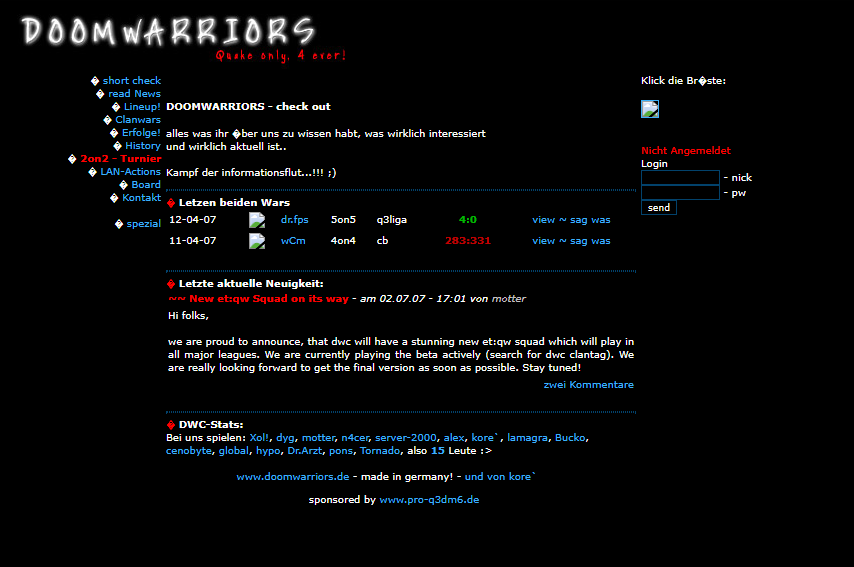

# Doomwarriors Homepage

Website for the Doomwarriors clan, featuring news, a clan-war archive, player
profiles, and the clan's history. The project is built with the Play Framework
and includes a protected administration area for managing news and clan wars.



## Features

- Homepage with the latest news and clan wars
- News and clan-war archives with results, maps, line-ups, and screenshots
- Player and squad overview
- Clan history, contact page, legal notice, and privacy policy
- Random images served from a configurable directory
- Administration area for creating and editing news and clan wars
- Historical data initialization using Play Evolutions

## Technology

- Java and Scala 2.13
- [Play Framework 3](https://www.playframework.com/)
- Twirl templates
- Ebean ORM
- PostgreSQL
- sbt

The exact versions used by the project are defined in `build.sbt`,
`project/build.properties`, and `project/plugins.sbt`.

## Requirements

- JDK 17 or newer
- sbt 1.12 or newer
- PostgreSQL

## Local Setup

1. Clone the repository and change into the project directory.

2. Create a PostgreSQL database:

   ```sql
   CREATE DATABASE dwc;
   ```

3. Update the database connection in `conf/application.conf`. Alternatively,
   use a separate configuration file that is not committed to version control,
   such as `conf/local.conf`:

   ```hocon
   include "application.conf"

   db.default.url = "jdbc:postgresql://localhost:5432/dwc"
   db.default.username = "postgres"
   db.default.password = "my-password"

   play.http.secret.key = "a-long-random-secret-key"
   picture_folder = "C:/path/to/images"
   ```

4. Optionally enable the administration area by setting both environment
   variables. Login remains disabled if either variable is missing.

   PowerShell:

   ```powershell
   $env:DWC_ADMIN_USERNAME = "admin"
   $env:DWC_ADMIN_PASSWORD = "a-secure-password"
   ```

   Linux/macOS:

   ```bash
   export DWC_ADMIN_USERNAME="admin"
   export DWC_ADMIN_PASSWORD="a-secure-password"
   ```

5. Start the application:

   ```bash
   sbt -Dconfig.file=conf/local.conf run
   ```

   If the values were configured directly in `application.conf`, run:

   ```bash
   sbt run
   ```

6. Open [http://localhost:9000](http://localhost:9000). On the first start,
   Play creates the tables and imports the historical sample data using the
   evolutions in `conf/evolutions/default`. The administration area is
   available at [http://localhost:9000/admin](http://localhost:9000/admin).

## Tests

```bash
sbt test
```

## Important Configuration

| Setting | Purpose |
| --- | --- |
| `db.default.*` | PostgreSQL connection |
| `play.http.secret.key` | Signing and session secret; always replace it in production |
| `DWC_ADMIN_USERNAME` | Administration-area username |
| `DWC_ADMIN_PASSWORD` | Administration-area password |
| `picture_folder` | Directory containing images served by `/random` |
| `owner.*` | Contact and legal-notice details |
| `privacy.*` | Privacy-policy details |

Do not commit credentials or production secrets. Provide them through
environment variables or a separate configuration file instead.

## Project Structure

```text
app/controllers/              HTTP endpoints and administration logic
app/models/                   Ebean data models
app/views/                    Twirl templates
conf/application.conf         Application configuration
conf/evolutions/default/      Database schema and historical data
conf/routes                   URL routing
public/                       Stylesheets, JavaScript, and images
test/                         Tests
build.sbt                     Build definition and dependencies
```

## Production

### Automated GitHub deployment to Ubuntu

`.github/workflows/ci-deploy.yml` tests and packages every pull request and
push to `master`. A successful push to `master` deploys the same artifact over SSH.
The server keeps five releases and automatically rolls back if the service or
HTTP healthcheck fails.

Copy the repository's `deploy` directory to the Ubuntu server and run as root
(change the domain in `deploy/nginx.conf` first if needed):

```bash
apt update
apt install -y openjdk-17-jre-headless nginx curl
useradd --create-home --shell /bin/bash dwc-deploy
install -d -o micha -g users -m 0755 /home/micha/dwc/releases /var/lib/dwc/pictures
install -d -o root -g root -m 0755 /etc/dwc
install -o root -g root -m 0755 deploy/deploy-dwc /usr/local/sbin/deploy-dwc
install -o root -g root -m 0644 deploy/dwc.service /etc/systemd/system/dwc.service
install -o root -g root -m 0440 deploy/dwc-sudoers /etc/sudoers.d/dwc-deploy
install -o root -g root -m 0644 deploy/nginx.conf /etc/nginx/sites-available/dwc
ln -s /etc/nginx/sites-available/dwc /etc/nginx/sites-enabled/dwc
cp deploy/application.conf.example /etc/dwc/prod.conf
cp deploy/environment.example /etc/dwc/environment
chown root:root /etc/dwc/prod.conf /etc/dwc/environment
chmod 0644 /etc/dwc/prod.conf
chmod 0600 /etc/dwc/environment
visudo -cf /etc/sudoers.d/dwc-deploy
systemctl daemon-reload
systemctl enable dwc.service
nginx -t && systemctl reload nginx
```

Edit `/etc/dwc/environment` with the real database/admin credentials and a
secret generated by `openssl rand -hex 32`. Adjust
`/etc/dwc/prod.conf` for production-specific settings. PostgreSQL and
the `dwc` database/user must already exist.

Create a dedicated SSH key locally and add its public half to
`/home/dwc-deploy/.ssh/authorized_keys`:

```bash
ssh-keygen -t ed25519 -C github-dwc-deploy -f dwc_deploy_key
```

In GitHub create an environment named `production` and add:

| Type | Name | Value |
| --- | --- | --- |
| Environment secret | `SSH_PRIVATE_KEY` | Contents of `dwc_deploy_key` |
| Environment secret | `SSH_KNOWN_HOSTS` | Verified output of `ssh-keyscan -H your-server` |
| Environment variable | `SSH_HOST` | Server hostname or IP address |
| Environment variable | `SSH_USER` | `dwc-deploy` |
| Environment variable | `SSH_PORT` | SSH port, normally `22` |

The first push to `master` installs and starts the application. Add required
reviewers to the GitHub environment if deployments need approval. Keep using
your existing TLS setup (for example Certbot); the nginx template contains the
reverse-proxy portion only.

### Manual package

Create a deployable package with:

```bash
sbt stage
```

Before starting the application in production, configure at least a secure
`play.http.secret.key`, the correct database credentials, the administration
variables, and the site-owner details. TLS should be provided by a reverse
proxy or the hosting platform.
